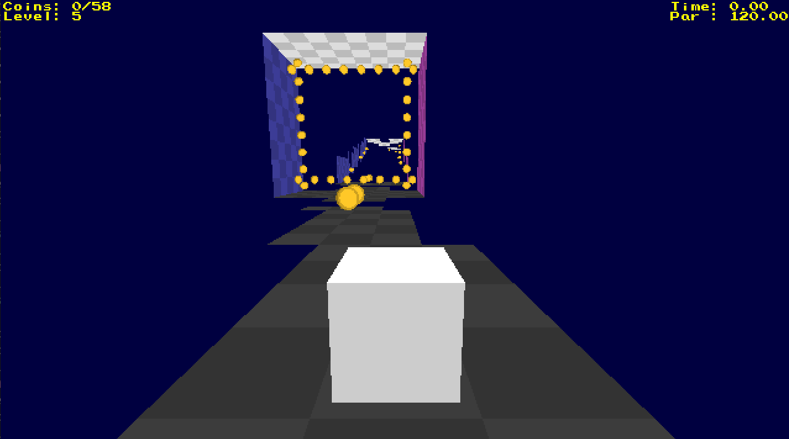

# Downshift - A olcPixelGameEngine3 Game

3D speed-run through hallways floating in space.
Change gravity by lashing onto walls.
Collect change (coins) along the way.
Try to beat par time.

OLC CodeJam 2026 entry, theme "Change".



## How to play

Collect every coin to turn the gate at the end of the hall from red to
green, then touch the gate. Falling out of the hall respawns you at the
start, and the clock keeps running.

| Key | Action |
|---|---|
| WASD | move |
| Space | jump (also starts the level from the intro card) |
| Left click | lash to a wall: it becomes your floor |
| Q | turn around |
| R | restart the level (also reloads the level file) |
| N | skip to the next level (on the intro card) |
| Esc | quit (desktop only) |
| \` | toggle the debug HUD |

## Play Online

Downshift has been submitted to the OLC CodeJam 2026.
You can play in your browser at

[https://bblodget.itch.io/downshift](https://bblodget.itch.io/downshift)

## Build and run

Needs a C++20 compiler (g++ 13 or newer) and a checkout of
[olcPixelGameEngine3](https://github.com/OneLoneCoder/olcPixelGameEngine3).

```bash
cmake -S . -B build          # once; uses /usr/bin/g++-13 if it exists
cmake --build build
cd build && ./downshift      # run from build/ so ./assets resolves
```

`build/assets` is a symlink to `assets/`, so edited levels show up without
rebuilding: press R in the game to reload.

Options (pass to the configure step):

- `-DPGE3_DIR=/path/to/olcPixelGameEngine3` if the repo isn't at `../repo/olcPixelGameEngine3`
- `-DUSE_WAYLAND=ON` native Wayland instead of X11 (needs libdecor-0-dev, wayland-protocols >= 1.43)
- `-DUSE_STB=ON` load images via stb_image (needs `stb_image*.h` in the PGE3 root)
- `-DCMAKE_BUILD_TYPE=Release` for a release build (default is RelWithDebInfo)

## Web build (Emscripten)

```bash
./package-web.sh             # Release build, writes dist/downshift-web.zip
cd dist/web && python3 -m http.server 8000      # open http://localhost:8000
```

The page must be served over HTTP; opening `index.html` as a file hangs at
"Downloading...". Levels are embedded via `--preload-file`, and the page
template is `web/shell.html` (based on OneLoneCoder's minimal
`basic_template.html`). On itch.io: project kind HTML, upload the zip, tick
"played in the browser", viewport 1280x720, enable the fullscreen button,
leave SharedArrayBuffer unticked.

## Levels

Levels are text files in `assets/levels/`, listed in `levelFiles[]` in
`src/main.cpp`. Each file has settings (`name`, `par`, `start`, and an
optional `text =` ... `endtext` block for the intro card), then one line per
slice of the hall. A slice has four groups, one per surface, in the order
floor, left wall, ceiling, right wall. Each group has one character per lane:

- `*` tile
- `-` hole
- `c` coin on a tile
- `o` coin over a hole

`#` starts a comment. `start = slice lane` counts from 0; the lane is
counted from the left wall when facing down the hall.

## License and credits

Copyright 2026 Brandon Blodget

This game uses the OLC-3 License. See [LICENSE.md](LICENSE.md).

Built with [olcPixelGameEngine3](https://github.com/OneLoneCoder/olcPixelGameEngine3),
Copyright 2018-2026 OneLoneCoder.com, used under the OLC-3 License.

AI disclosure: the gameplay code (`src/main.cpp`) and levels were written by
me. Claude (Anthropic) was used as a guide and code reviewer. AI-written
code: the Camera3D helper (`src/camera3D.h`) and the build tooling (CMake
setup and `package-web.sh`).
